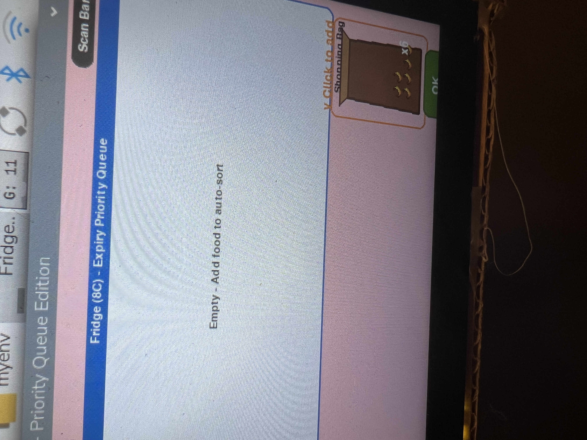
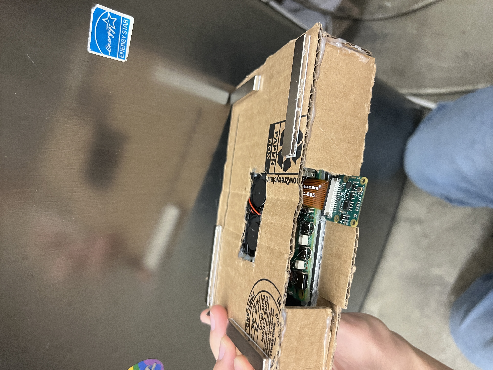
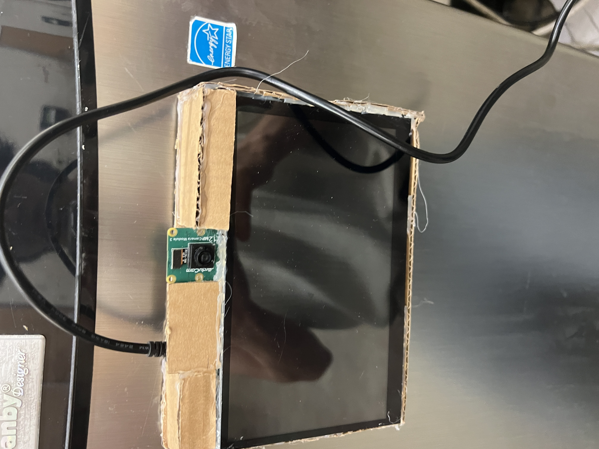
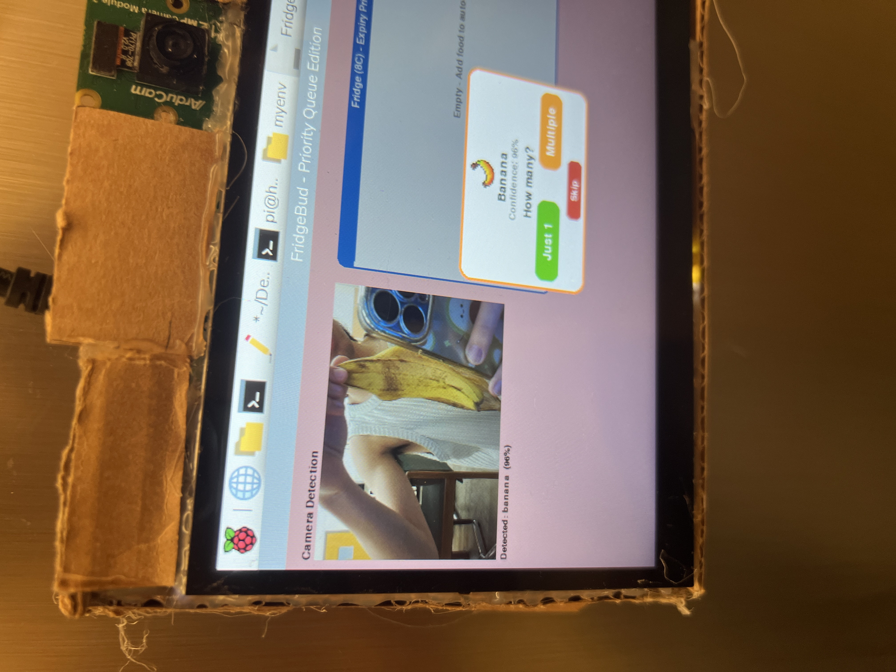
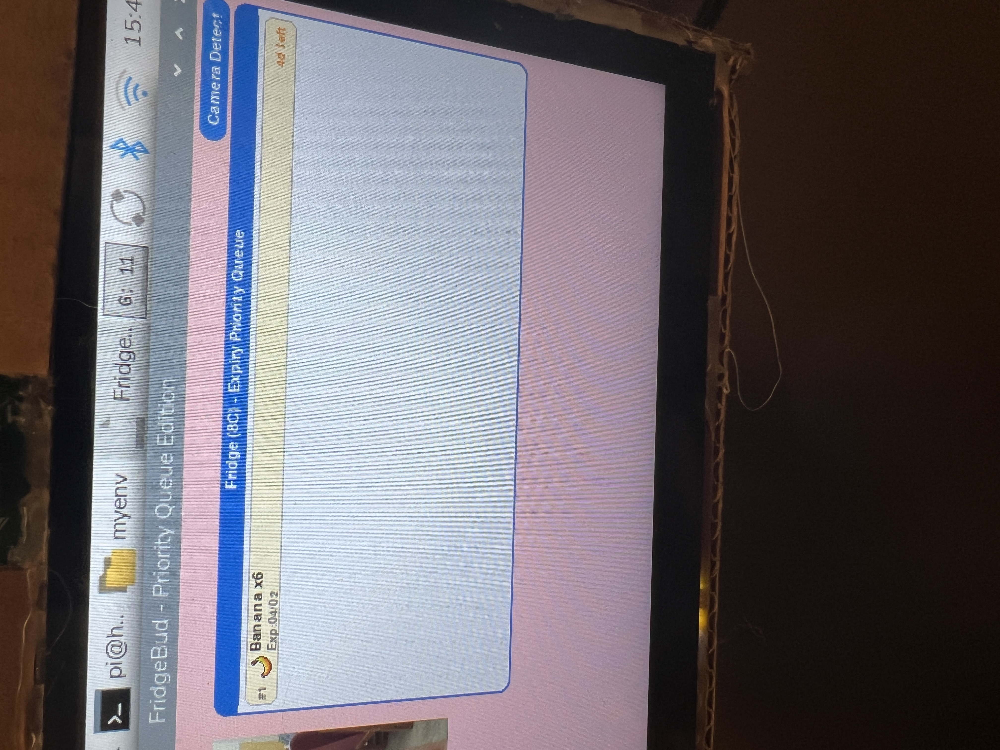

# 🧊 FridgeBud

Smart Fridge Companion that tracks food freshness and reduces waste using AI vision, sensors, and a touchscreen interface.



---

## Table of Contents

- [Overview](#overview)
- [Key Features](#key-features)
- [System Architecture](#system-architecture)
- [Hardware](#hardware)
  - [Bill of Materials](#bill-of-materials)
  - [ESP32-C3 Wiring](#esp32-c3-wiring)
  - [Raspberry Pi Wiring](#raspberry-pi-wiring)
- [Software](#software)
  - [ESP32-C3 Firmware](#esp32-c3-firmware)
  - [Raspberry Pi System](#raspberry-pi-system)
  - [Touchscreen UI](#touchscreen-ui)
- [Setup Guide](#setup-guide)
- [Repo Structure](#repo-structure)
- [Roadmap](#roadmap)
- [License](#license)

---

## Overview

FridgeBud is an IoT system that attaches to a refrigerator and helps users manage food inventory automatically. Using an internal camera, AI food recognition, and a Pygame touchscreen interface, FridgeBud detects what food is stored, tracks expiration dates, and reminds users before food goes bad.

The goal is to **reduce food waste, improve food organization, and simplify meal planning**.

---

## Key Features

- **AI food recognition** — PyTorch + HuggingFace image classification, camera auto-detects new food
- **Smart expiration tracking** — OpenAI GPT-4o-mini estimates shelf life based on food type and fridge temperature
- **Priority queue** — food items sorted by expiration urgency, eat-first-what-expires-first
- **Barcode scanning** — pyzbar decodes barcodes, auto-lookup via Open Food Facts API
- **Ultrasonic door detection** — ESP32-C3 senses when you approach the fridge
- **Pixel art UI** — Pygame touchscreen interface with 60+ food sprites, animations, flying fruit effects
- **Recipe suggestions** — AI-powered recipe ideas based on what's in your fridge
- **Dark/Light theme** — toggleable UI theme with smooth transitions
- **LCD status display** — 1602 LCD shows quick status messages

---

## System Architecture

```
┌─────────────────────────────────────────────────────────────────────┐
│                          FridgeBud System                           │
│                                                                     │
│  ┌──────────────┐    UART (JSON)    ┌────────────────────────────┐  │
│  │  ESP32-C3    │ ────────────────► │     Raspberry Pi           │  │
│  │              │                   │                            │  │
│  │  • Ultrasonic│                   │  ┌──────────┐  ┌────────┐ │  │
│  │  • POT       │                   │  │ system.py│  │ LCD    │ │  │
│  │  • 2× Button │                   │  │ (UART RX)│  │ 1602   │ │  │
│  └──────────────┘                   │  └──────────┘  └────────┘ │  │
│                                     │                            │  │
│                                     │  ┌──────────────────────┐  │  │
│                                     │  │  Pygame UI (1200×700) │  │  │
│  ┌──────────────┐                   │  │                      │  │  │
│  │   Camera     │ ───── USB ──────► │  │  • AI food classify  │  │  │
│  │  (USB/CSI)   │                   │  │  • Barcode scan      │  │  │
│  └──────────────┘                   │  │  • Priority queue    │  │  │
│                                     │  │  • Recipe suggest    │  │  │
│                                     │  │  • Expiry alerts     │  │  │
│  ┌──────────────┐                   │  └──────────────────────┘  │  │
│  │  Touchscreen │ ◄─── HDMI ─────── │                            │  │
│  │  Display     │                   │                            │  │
│  └──────────────┘                   └────────────────────────────┘  │
│                                                                     │
│  ┌──────────────────────────────────────────────────────────────┐   │
│  │                     Cloud APIs                               │   │
│  │  • OpenAI GPT-4o-mini (shelf life estimation)                │   │
│  │  • Open Food Facts (barcode lookup)                          │   │
│  └──────────────────────────────────────────────────────────────┘   │
└─────────────────────────────────────────────────────────────────────┘
```

---

## Hardware

### Bill of Materials

| Item | Qty | Notes |
|------|-----|-------|
| Raspberry Pi 4 | 1 | Main controller |
| ESP32-C3 DevKit | 1 | Sensor hub |
| USB Camera | 1 | Food recognition |
| Touchscreen display | 1 | 7" HDMI recommended |
| LCD 1602 | 1 | Status display |
| HC-SR04 Ultrasonic sensor | 1 | Door/proximity detection |
| Potentiometer | 1 | Menu navigation |
| Push buttons | 2 | User input |
| Jumper wires, breadboard | — | Connections |

### ESP32-C3 Wiring

```
ESP32-C3
┌────────────────┐
│  GPIO 3  ──────┼──── Potentiometer (wiper)
│  GPIO 6  ──────┼──── Button 1 (INPUT_PULLUP)
│  GPIO 2  ──────┼──── Button 2 (INPUT_PULLUP)
│  GPIO 1  ──────┼──── HC-SR04 TRIG
│  GPIO 0  ──────┼──── HC-SR04 ECHO
│  GPIO 21 (TX) ─┼──── Raspberry Pi RX
│  GPIO 20 (RX) ─┼──── Raspberry Pi TX
│  GND     ──────┼──── Common GND (shared with Pi)
│  3.3V    ──────┼──── Sensor VCC
└────────────────┘
```

### Raspberry Pi Wiring

```
Raspberry Pi (BCM mode)
┌────────────────┐
│  GPIO 17 ──────┼──── LCD RS
│  GPIO 27 ──────┼──── LCD EN
│  GPIO 5  ──────┼──── LCD D4
│  GPIO 6  ──────┼──── LCD D5
│  GPIO 13 ──────┼──── LCD D6
│  GPIO 19 ──────┼──── LCD D7
│  RX (GPIO 15) ─┼──── ESP32-C3 TX (GPIO 21)
│  GND     ──────┼──── LCD GND + ESP32 GND
│  5V      ──────┼──── LCD VCC
│  USB     ──────┼──── Camera
│  HDMI    ──────┼──── Touchscreen
└────────────────┘
```

---

## Software

### ESP32-C3 Firmware

**File:** `firmware/sensorFusion.ino`

Reads sensors, applies EMA filtering and deadband, sends JSON over UART only when values change:

```json
{"pot":2048,"b1":0,"b2":1,"dist":15.3}
```

| Sensor | Filter | Threshold |
|--------|--------|-----------|
| Potentiometer | EMA (α=0.15) | ±15 ADC counts |
| Ultrasonic | EMA (α=0.3) | ±1.5 cm |
| Buttons | Debounce 200ms | — |

### Raspberry Pi System

**File:** `raspi/system.py`

Multi-threaded system with UART listener, logic loop, LCD driver, and camera control. Detects proximity via ultrasonic data and triggers camera capture on button press.

**File:** `raspi/lcd2.py`

LCD 1602 driver using 4-bit GPIO mode (no I2C needed).

### Touchscreen UI

**Main app:** `app/test13_pq.py`

Pygame-based 1200×700 touchscreen interface featuring:

- **AI food classification** — HuggingFace `AutoModelForImageClassification` with PyTorch
- **Scene-change detection** — camera only classifies when fridge contents change
- **OpenAI shelf life estimation** — GPT-4o-mini predicts expiry based on food type and fridge temp
- **Barcode scanning** — pyzbar + Open Food Facts API lookup
- **Priority queue panel** — sorted by days-until-expiry, color-coded urgency
- **Flying fruit animations** — pixel sprites animate into the fridge bag
- **Recipe suggestions** — AI generates recipes from current inventory
- **Dark/Light theme toggle** — smooth animated transitions
- **Notification system** — toast-style alerts

---

## Setup Guide

### Step 1: Wire up the ESP32-C3 sensors



### Step 2: Connect ESP32-C3 to Raspberry Pi via UART



### Step 3: Wire the LCD 1602 to Raspberry Pi GPIO



### Step 4: Mount camera and display on the fridge


### Step 5: Complete system running



### Software Installation

```bash
# On Raspberry Pi
sudo apt update
sudo apt install python3-pygame python3-opencv python3-serial

# Python dependencies
pip install torch torchvision transformers pillow pyzbar

# Set your OpenAI API key
export OPENAI_API_KEY="your-key-here"

# Flash ESP32-C3 firmware
# Open firmware/sensorFusion.ino in Arduino IDE
# Select board: ESP32C3 Dev Module
# Upload

# Run the UI
cd app
python3 test13_pq.py
```

---

## Repo Structure

```
FridgeBud/
├── README.md
│
├── app/
│   └── test13_pq.py                ← Main UI application
│
├── firmware/
│   └── sensorFusion.ino            ← ESP32-C3 firmware (sensors + UART)
│
├── raspi/
│   ├── system.py                   ← Pi main program (UART + LCD + camera)
│   ├── lcd2.py                     ← LCD 1602 GPIO driver
│   └── pi.py                       ← Pi utilities
│
├── docs/
│   ├── fridgebud_architecture.docx  ← Architecture design doc
│   └── pic/
│       ├── step1.JPG ~ step5.JPG   ← Setup step photos
│
├── ppt/
│   ├── FridgeBud_Pitch_Deck.pptx   ← Project pitch deck
│   └── FridgeBud_Summary.docx      ← Project summary
│
├── FreePixelFood/                  ← Pixel food sprite assets (60+ icons)
│   └── Assets/FreePixelFood/Sprite/Food/
│
└── archive/                        ← Historical UI iterations
    ├── test.py ~ test12.py
    ├── test14_barcode.py
    ├── test15_more_func.py
    ├── test16.py
    └── test17.py
```

---

## Roadmap

- [x] AI food recognition (PyTorch + HuggingFace)
- [x] Expiration tracking with priority queue
- [x] Barcode scanning + Open Food Facts lookup
- [x] OpenAI shelf life estimation
- [x] ESP32-C3 sensor fusion (ultrasonic + POT + buttons)
- [x] LCD 1602 status display
- [x] Pixel art UI with animations
- [x] Dark/Light theme toggle
- [x] Recipe suggestions
- [ ] Voice input (OpenAI Whisper API)
- [ ] Database backend (MySQL / SQLite)
- [ ] Cloud sync and mobile notifications
- [ ] Food category classification view
- [ ] Shopping list generation

---

## License

MIT